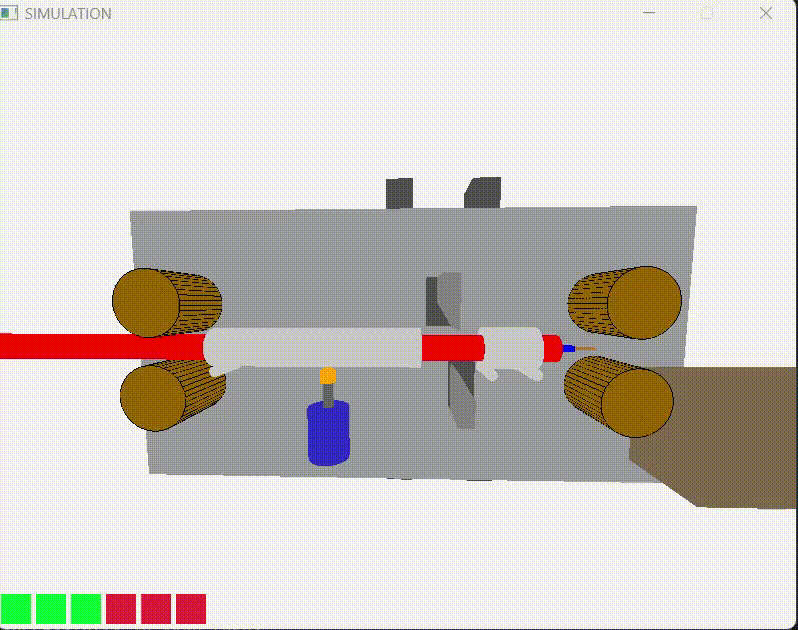

# CableCuttingSimulation
This is a project i have been working on for visualizing how the cable cutting and stripping machine works.
## Demo


##### I used the Raylib graphic library for this project. So you need to install that before you can compile this project.
[Raylib Library](https://github.com/raysan5/raylib)\

### Compiling on Terminal:
``` g++ main.cpp initCamera.cpp initCamera.h debugOption.cpp debugOption.h staticParts.h staticParts.cpp movingParts.h movingParts.cpp operationControl.h operationControl.cpp -o main.exe -lraylib -lwinmm -lgdi32 -lopengl32 -lkernel32 -L C:\"Your_Raylib_Directory"\src -I C:\"Your_Raylib_Directory"\src ```
